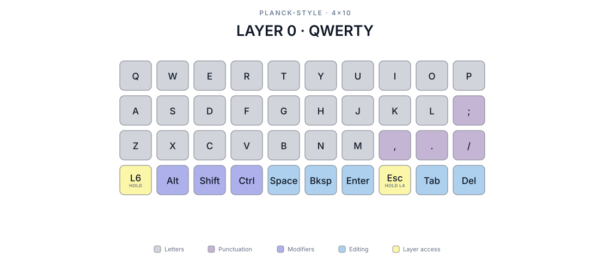
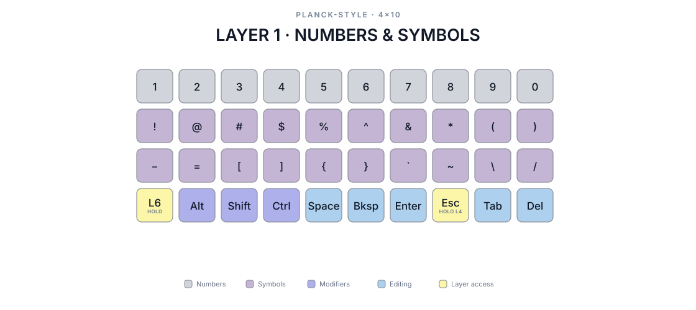
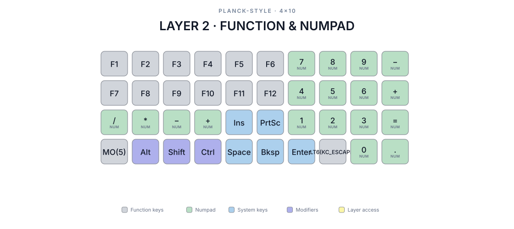
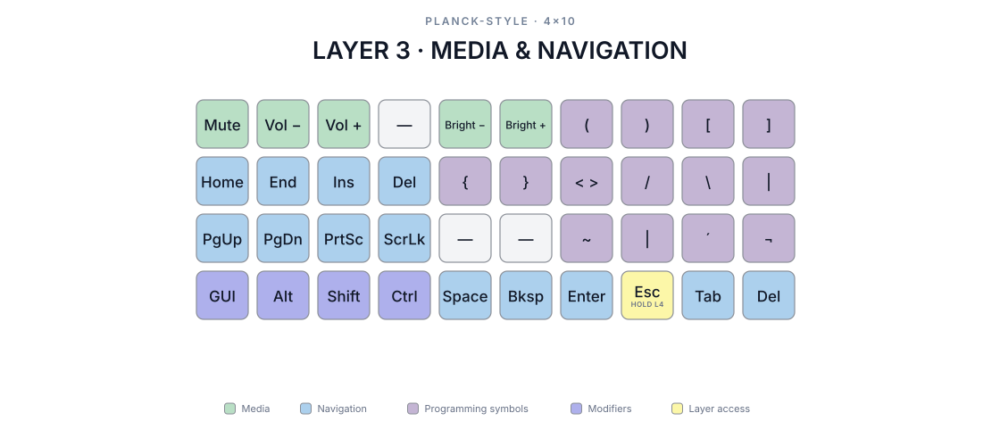
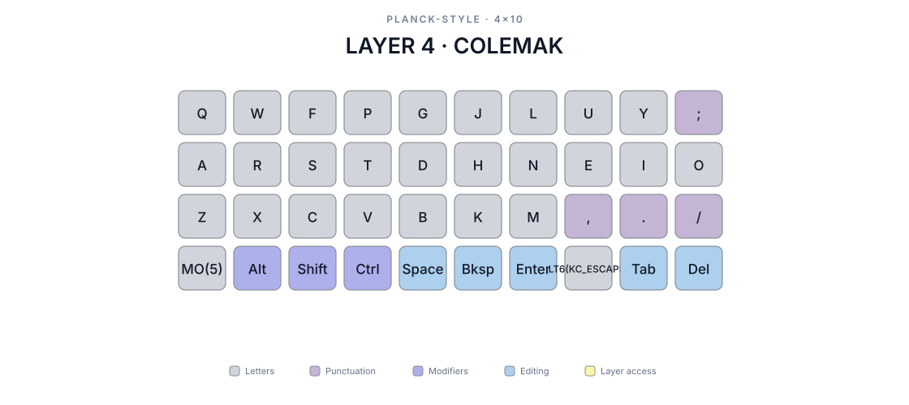
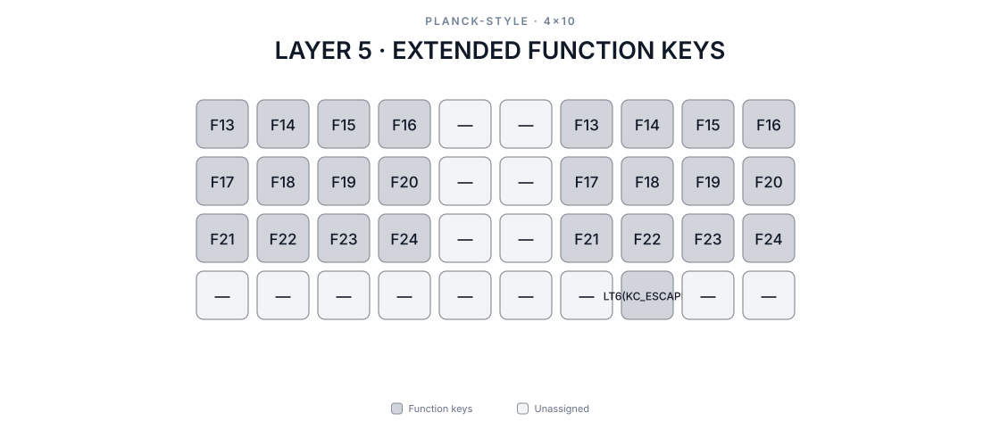
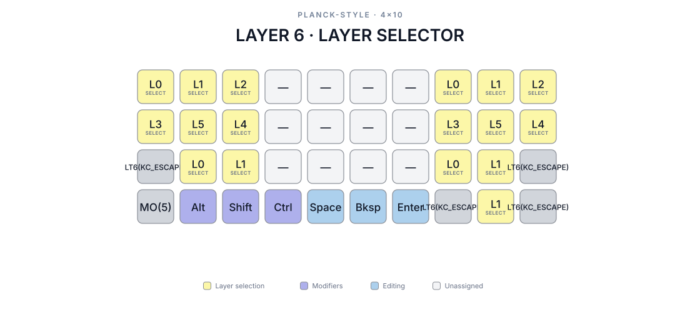

# Layer reference

These diagrams are generated from the current Vial backup.

## Layer 0 — QWERTY



## Layer 1 — Numbers and symbols



## Layer 2 — Function and numpad



## Layer 3 — Media and navigation



## Layer 4 — Colemak



## Layer 5 — Extended function keys



## Layer 6 — Layer selector



The mirrored `F13`–`F24` blocks are available for host-defined shortcuts from
either hand. The configured desktop host maps both blocks to virtual desktops
1–12.

Layers 7 through 15 are reserved and currently unassigned.

## Regenerating

The diagrams are generated by
[`scripts/generate_layer_diagrams.py`](../../../scripts/generate_layer_diagrams.py)
directly from the Vial backup. The generator uses only the Python standard
library and requires Python 3.10 or newer.

From the repository root, run the Make target:

```sh
make diagrams
```

The source keymap is:

```text
keymap.vil
```

The command deterministically rewrites the active layer diagrams in this
directory. Layer titles, legend labels, colors, and output filenames are
defined in `LAYER_METADATA` inside the generator.
